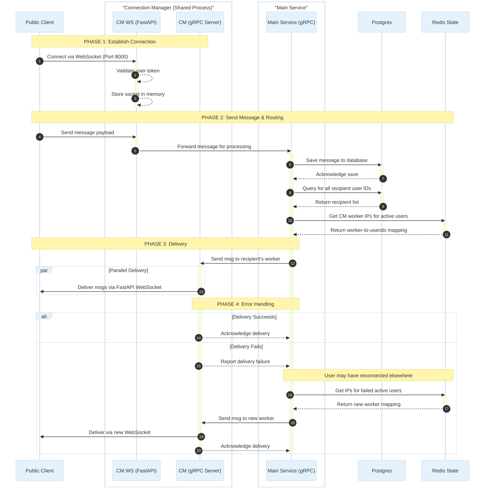

# Ping ⚡

> A production-ready real-time chat application, built phase by phase — to understand what happens when systems need to scale.

It's a deliberate exercise in **High Level System Design**, **concurrency**, and **multi-threading** — built with the goal of watching each architectural decision either hold up or break.

**Live Demo:** [16.112.64.12.nip.io/chatapp/](http://16.112.64.12.nip.io/chatapp/)

---

## Features

- Real-time direct and group messaging over WebSocket
- Google OAuth 2.0 + username/password authentication
- Group management with admin roles, member add/remove, and promotion
- Message receipts tracking
- Fully responsive UI — mobile and desktop
- JWT-based session management

---

## Tech Stack

| Layer | Technology |
|---|---|
| Frontend | React 18, Vite, Tailwind CSS |
| Backend | Python, FastAPI (async), SQLAlchemy (async) |
| Database | PostgreSQL (`asyncpg`) |
| Auth | Google OAuth 2.0, bcrypt, JWT |
| Infrastructure | AWS EC2 (t3.micro), Nginx (reverse proxy + static server) |
| CI/CD | GitHub Actions |
| Testing | `pytest-asyncio` (integration), k6 (load) |
| Future | C++ (connection manager), gRPC |

---

## Roadmap

- [x] [**Phase 1: Single Service (Current)**](#phase-1-single-service-current) — Single FastAPI server monolith, WebSocket messaging, full CI/CD.
- [x] Integration test suite (auth, users, groups).
- [x] Phase 1 load test report (k6).
- [x] [**Phase 2: Monolithic to Microservice**](#phase-2-monolithic-to-microservice) — Extract Python Connection Manager over gRPC.
      Completed but not deployed yet.
- [ ] Phase 2 load test report (k6).
- [ ] [**Phase 3: Horizontal Scaling**](#phase-3-horizontal-scaling) — Scale over multiple AWS instances with Redis state sync.
- [ ] Phase 3 load test report (k6).
- [ ] [**Phase 4: Go Connection Manager**](#phase-4-go-connection-manager) — Rewrite Connection Manager in Go for true multi-core, non-blocking I/O.
- [ ] Phase 4 load test report (k6).
- [ ] [**Phase 5: Perfection & Features**](#phase-5-perfection--features) — Feature completeness (Read receipts, presence, OS-level push notifications).

---

## Architecture & Phases

### Phase 1: Single Service (Current)
```text
Browser
  │
  ▼
Nginx  ──────────────────────►  Static Frontend (React/Vite build)
  │
  ▼
FastAPI (Uvicorn/Gunicorn)
  │               │
  ▼               ▼
PostgreSQL     WebSocket
(RDS)          Connection Manager
               (Python, in-process)
```

A single FastAPI server running a single worker on an **AWS t3.micro** instance handles everything — REST APIs, WebSocket connections, and serves as the origin for Nginx to proxy. The connection manager lives inside the single Python process, which means it shares the Global Interpreter Lock (GIL). It works, but it binds network I/O and CPU-bound application logic together, creating limits that become visible under load.

Load testing with **k6** is run at each phase. Results will be published as HTML reports in the repository as they are completed.

> CI/CD is live from day one. Every push to `main` runs the full integration test suite against a real PostgreSQL instance before any deployment happens.

---

### Phase 2: Monolithic to Microservice

To prepare for high concurrency, the application logic and the transport layer must be decoupled. The WebSocket Connection Manager will be extracted into its own dedicated Python service. 

Instead of HTTP, the Main Service and the Connection Manager will communicate internally using **gRPC**. 

Decoupling allows the Main Service to focus purely on database transactions and business logic, while the Connection Manager acts strictly as a dumb router managing the `epoll` event loop for open WebSockets.

---

### Phase 3: Horizontal Scaling

Once the microservice architecture is stable, the system scales out across multiple AWS instances:

```text
                    ┌─────────────────────────────┐
Browser ──► Nginx ──┤  Load Balancer              │
           (L7)     └──┬──────────────┬────────────┘
                       │              │
                 Node 1 (EC2)   Node 2 (EC2)
                ┌────────────┐ ┌────────────┐
                │ Main Svc   │ │ Main Svc   │
                │ ConnMgr    │ │ ConnMgr    │
                └──────┬─────┘ └──────┬─────┘
                       │              │
                       └──────┬───────┘
                              ▼
                     Redis (State Sync)
```

**Why Redis?** 
When a user sends a message to a chat room, the backend needs to deliver it to multiple users. In a multi-node setup, User A might be connected to Node 1, and User B to Node 2. Redis acts as the central nervous system. When a message is sent, the Main Service queries Redis to find out exactly which Connection Manager worker holds the recipient's WebSocket, allowing targeted delivery without broadcasting to every server.

**Why gRPC for Internal Communication?**
Standard HTTP/REST is heavy. It requires parsing large text headers and setting up new TCP connections constantly. gRPC uses HTTP/2 and Protobufs, meaning the data is serialized into a highly compressed, ultra-fast binary format. It multiplexes thousands of requests over a single persistent TCP connection, eliminating the bottleneck of internal microservice chatter.

---

### Phase 4: Go Connection Manager

While Phase 3 provides scalability, Python's `asyncio` is ultimately limited by the GIL and heavy memory overhead per connection. The Python Connection Manager will be completely rewritten in **Go**.
```text
FastAPI Main ──── gRPC ────►  Go Connection Manager
                              (Goroutines, Netpoll,
                               All CPU cores utilized)
```

**The Advantages of the Go Switch:**
*   **Raw Speed:** Go's compiled runtime drastically outperforms Python/FastAPI for raw network throughput.
*   **True Multithreading:** Unlike Python's single-core GIL restriction, a single Go worker dynamically utilizes all available CPU cores. 
*   **Minimal Overhead:** Go manages thousands of concurrent connections using lightweight Goroutines (taking kilobytes of memory) rather than heavy OS threads.
*   **Optimized Network I/O:** Go utilizes a highly optimized internal `netpoller` (interfacing directly with Linux `epoll`). It requires only one network card reader thread to manage thousands of active sockets, drastically reducing context-switching CPU overhead.

---

### Phase 5: Perfection & Features

With a horizontally scalable, Go-powered, non-blocking architecture in place, the system will have the overhead capacity to handle complex, high-frequency state updates.

This phase will introduce:
*   **Real-time Read & Delivery Receipts** (High-frequency WS chatter).
*   **Live User Status / Presence** (Online/Offline/Typing indicators synchronized via Redis).
*   **Push Notifications** (Android / Windows desktop background notifications).

---

## CI/CD Pipeline
```text
Push to main
     │
     ▼
┌─────────────────────────────┐
│  GitHub Actions             │
│                             │
│  1. Spin up PostgreSQL      │
│  2. Run full integration    │
│     test suite              │
│     (pytest-asyncio)        │
│                             │
│  ✓ Pass → Deploy to EC2     │
│  ✗ Fail → Block deploy      │
└─────────────────────────────┘
```

Tests cover authentication (JWT gating, credential login, Google OAuth flow), user APIs, group lifecycle (create, update, add/remove members, admin promotion, delete), and WebSocket message routing.

No merge reaches the server without passing all of them.

---

## Running Locally

**Backend**
```bash
cd backend
python -m venv venv && source venv/bin/activate
pip install -r requirements.txt

# Create a .env file
# DATABASE_URL=postgresql+asyncpg://...
# JWT_SECRET=...
# WEBCLIENT_ID=... (Google OAuth client ID)

uvicorn main:app --reload
```

**Frontend**
```bash
cd frontend
npm install

# Create a .env file
# VITE_API_URL=http://localhost:8000
# VITE_WS_URL=ws://localhost:8000
# VITE_GOOGLE_CLIENT_ID=...

npm run dev
```

**Running Tests**
```bash
cd backend
pytest -v

# Specific test file or class
pytest tests/test_groups.py::TestCreateGroup -v
```

---

## Project Goals

- Build something that handles real concurrency, not just simulated.
- Make every architectural decision traceable to a measurable outcome (load test).
- Practice the full lifecycle: design → implement → test → break → redesign.
